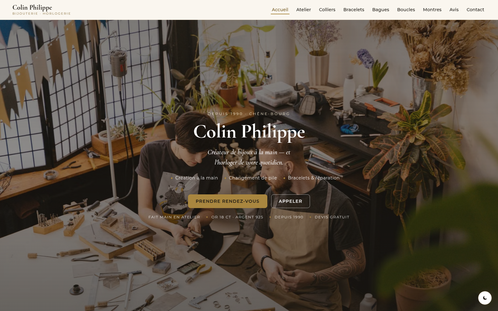
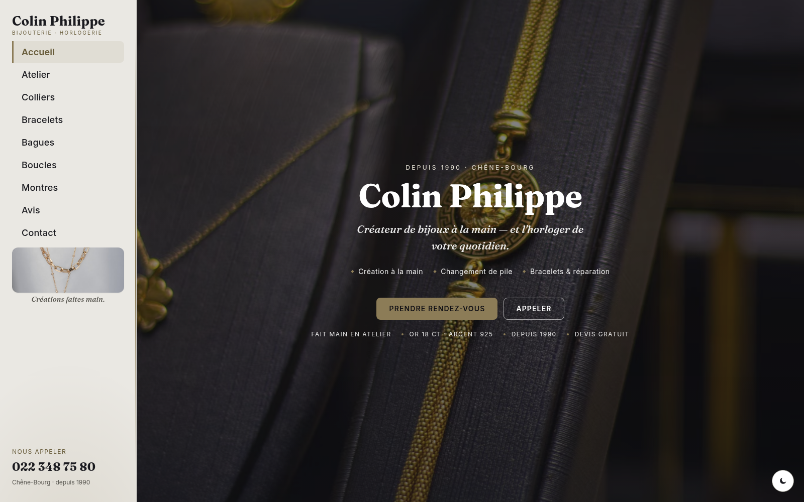
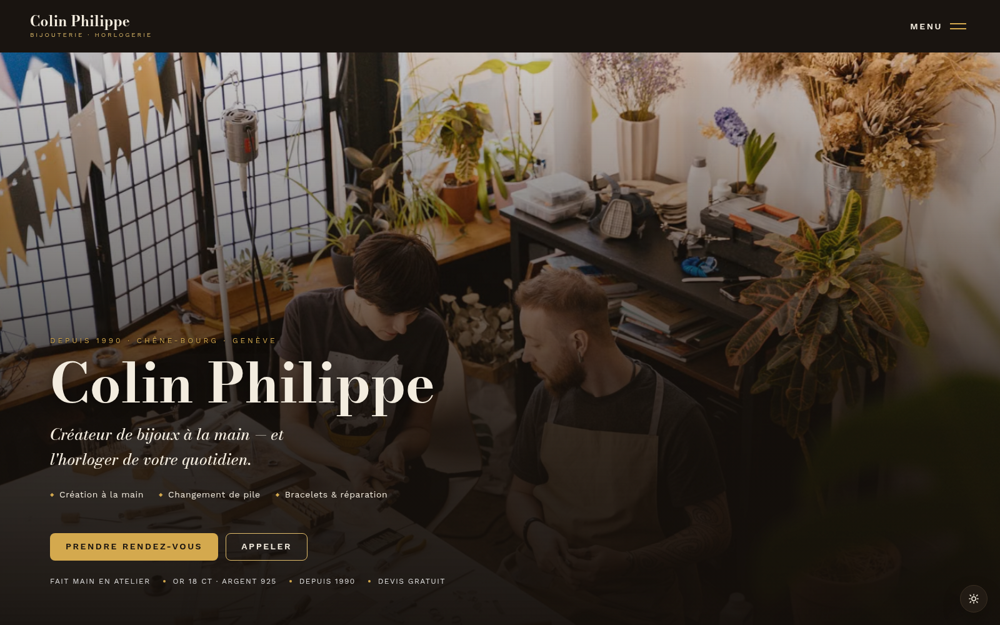
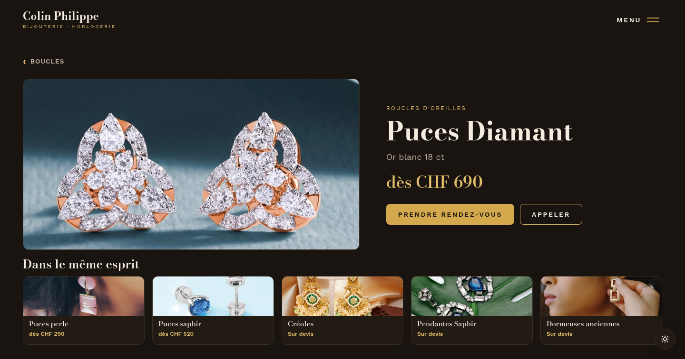
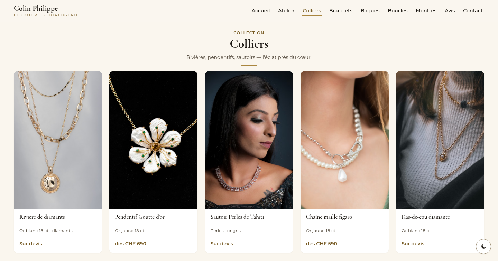

# Colin Philippe — Bijouterie-Horlogerie

Site vitrine pour **Colin Philippe**, bijouterie-horlogerie à **Chêne-Bourg (Genève)**, créateur de bijoux à la main depuis 1990.
Trois directions de design proposées au client — il ouvre, compare, choisit.

### 🔗 Démo en ligne → **https://sky1241.github.io/philippe-colin-bijouterie/**

---

## Les 3 propositions

| Version 1 — Élégante | Version 2 — Rail latéral | Version 3 — Luxe sombre |
| :---: | :---: | :---: |
|  |  |  |
| Barre de navigation en haut, palette **or chaud / ivoire**, hero plein écran. La valeur sûre. | Rail de navigation à gauche (téléphone toujours visible), palette **platine / perle froide**. | Éditorial et audacieux : fond **charbon chaud + laiton**, menu plein écran, mise en page asymétrique. |
| _Cormorant Garamond + Montserrat_ | _Fraunces + Inter_ | _Bodoni Moda + Work Sans_ |

---

## Ce que fait le site

- **Zéro défilement** — chaque vue tient dans un écran, la navigation bascule les vues (vrai sur laptop **et** téléphone).
- **5 catégories** — colliers, bracelets, bagues, boucles d'oreilles, montres.
- **Clic sur un produit → sa fiche + 5 suggestions du même type** (même sous-type d'abord).
- **Positionnement** — créateur de bijoux à la main **+** horloger de proximité (changement de pile, bracelets de montre, réparation).
- **Thème clair / sombre**, avis Google réels (5,0 · 11 avis), réservation & appel en un geste.
- Responsive, contrastes vérifiés **WCAG AA**, calé sur la bibliothèque de règles UX interne.

| Vue produit → 5 suggestions | Vue catégorie |
| :---: | :---: |
|  |  |

---

## Structure

```
index.html              → page de choix « 3 propositions »
v1-elegant-topnav/      → Version 1 (barre haute)
v2-sidebar/             → Version 2 (rail gauche)
v3-creative/            → Version 3 (luxe sombre)
shared/                 → site-data.js (contenu commun) + favicon
previews/               → aperçus
```

Chaque version = `index.html` + `css/style.css` + `js/main.js`. Le contenu (produits, avis, infos boutique) vient d'un seul fichier : `shared/site-data.js`.

---

## À savoir

> **Maquettes.** Les photos sont des **illustrations** (banques d'images libres), à remplacer par les vraies pièces de l'atelier. Les avis Google, eux, sont réels.

**Infos boutique :** Rue de Genève 71, 1225 Chêne-Bourg (GE) · 022 348 75 80 · depuis 1990.
