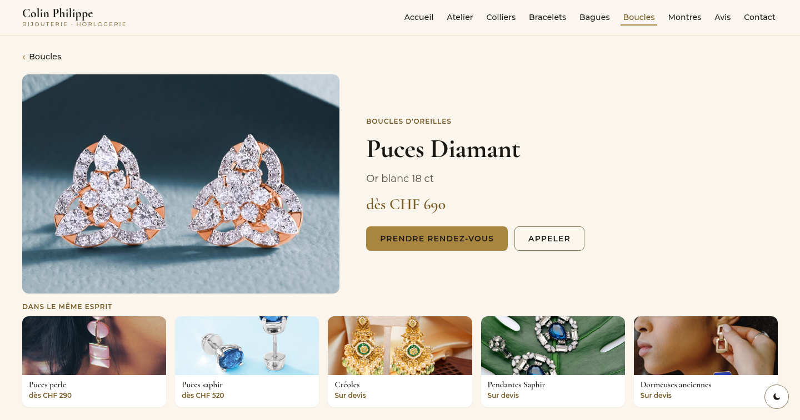
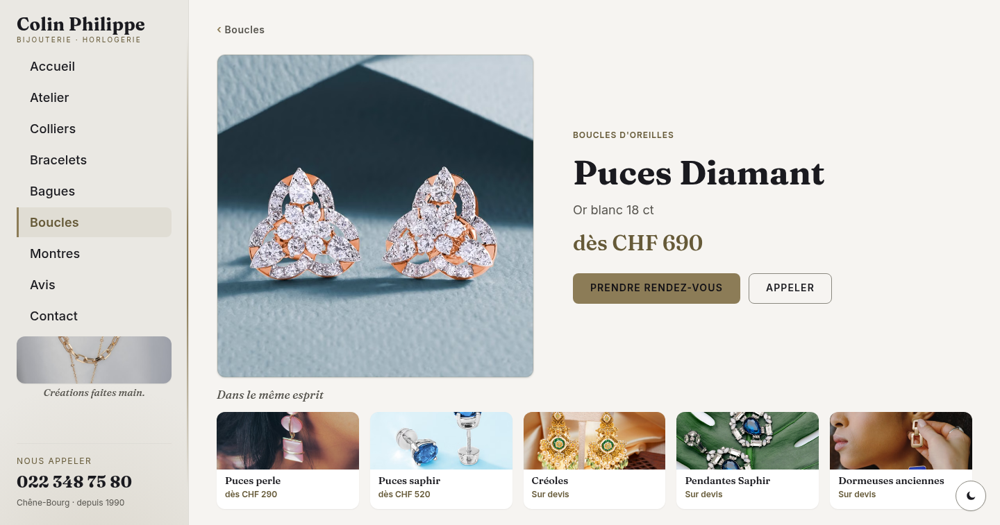
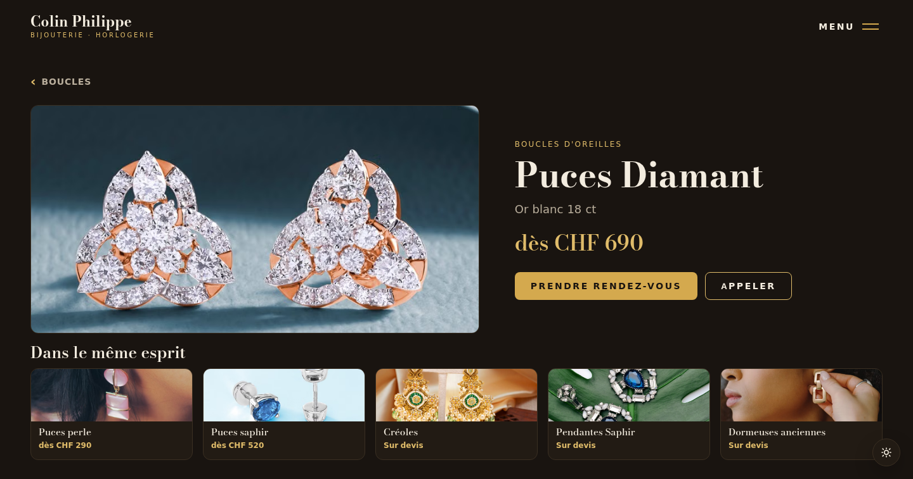

# Colin Philippe — Bijouterie-Horlogerie

Site vitrine pour **Colin Philippe**, bijouterie-horlogerie à **Chêne-Bourg (Genève)**, créateur de bijoux à la main depuis 1990.
Trois directions de design proposées au client — il ouvre, compare, choisit.

### 🔗 Démo en ligne → **https://sky1241.github.io/philippe-colin-bijouterie/**

---

## Les 3 propositions

| Version 1 — Élégante | Version 2 — Rail latéral | Version 3 — Luxe sombre |
| :---: | :---: | :---: |
|  |  |  |
| Barre de navigation en haut, palette **or chaud / ivoire**. La valeur sûre. | Rail de navigation à gauche (téléphone toujours visible), palette **platine / perle froide**. | Éditorial et audacieux : **charbon chaud + laiton**, menu plein écran, mise en page asymétrique. |
| _Cormorant Garamond + Montserrat_ | _Fraunces + Inter_ | _Bodoni Moda + Work Sans_ |

Trois **identités vraiment distinctes** : chacune sa palette, ses polices et sa structure de navigation.

---

## La fonctionnalité phare : clic sur un produit → sa fiche + 5 suggestions

Cliquer n'importe quelle pièce ouvre sa fiche et propose **5 pièces du même type** (même sous-type d'abord). Voici la **même fiche dans les 3 styles** :

| Version 1 | Version 2 | Version 3 |
| :---: | :---: | :---: |
|  |  |  |

---

## Ce que fait le site

- **Zéro défilement** — chaque vue tient dans un écran, la navigation bascule les vues (vrai sur laptop **et** téléphone).
- **5 catégories** (colliers, bracelets, bagues, boucles d'oreilles, montres) + fiche produit avec **5 suggestions**.
- **Positionnement** : créateur de bijoux à la main **+** horloger de proximité (changement de pile, bracelets, réparation).
- **Thème clair / sombre**, avis Google réels (5,0 · 11 avis), réservation & appel en un geste.
- **Formulaire de contact** (ouvre l'e-mail pré-rempli, zéro serveur).

## Côté sérieux / prêt à lancer

- ♿ **Accessibilité WCAG AA** vérifiée (contrastes, cibles tactiles, focus clavier, navigation).
- 🔒 **Respect de la vie privée** : polices **auto-hébergées** (aucun appel à Google Fonts), **aucune carte Google embarquée**, **aucun cookie** → **pas besoin de bandeau cookies**.
- 📊 **Analytics sans cookies** (GoatCounter) — statistiques anonymes et agrégées.
- 📄 **Mentions légales** + **politique de confidentialité**.
- 🔎 **SEO** : `sitemap.xml`, `robots.txt`, métadonnées & données structurées (JewelryStore), page **404** propre, favicons + manifest (PWA).

---

## Structure

```
index.html              → page de choix « 3 propositions »
v1-elegant-topnav/      → Version 1 (barre haute)
v2-sidebar/             → Version 2 (rail gauche)
v3-creative/            → Version 3 (luxe sombre)
shared/site-data.js     → contenu commun (produits, avis, infos boutique)
mentions-legales.html · confidentialite.html · 404.html · sitemap.xml · robots.txt
docs/liste-prise-de-vue.md → check-list pour le shooting photo
```

Chaque version = `index.html` + `css/style.css` + `js/main.js` + `fonts/` (polices locales).

---

## À savoir

> **Maquettes.** Les photos sont des **illustrations** (banques d'images libres), à remplacer par les vraies pièces de l'atelier — voir la **[liste de prise de vue](docs/liste-prise-de-vue.md)**. Les avis Google, eux, sont réels.

**Infos boutique :** Rue de Genève 71, 1225 Chêne-Bourg (GE) · 022 348 75 80 · depuis 1990.
